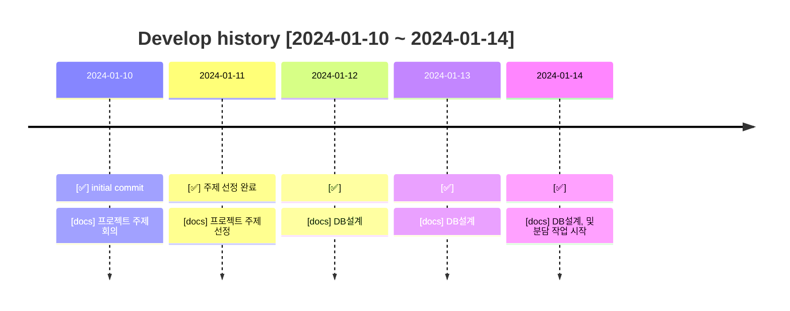
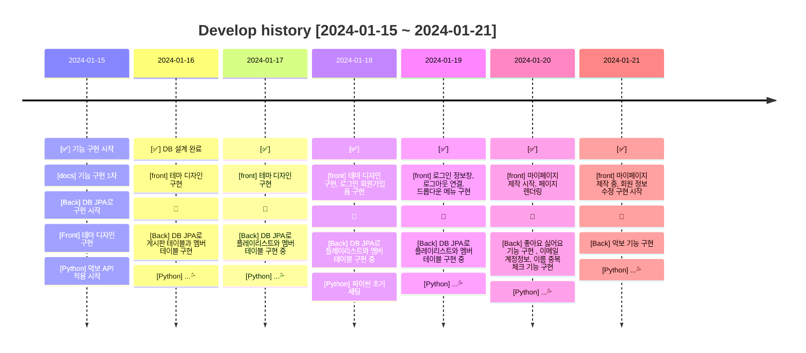
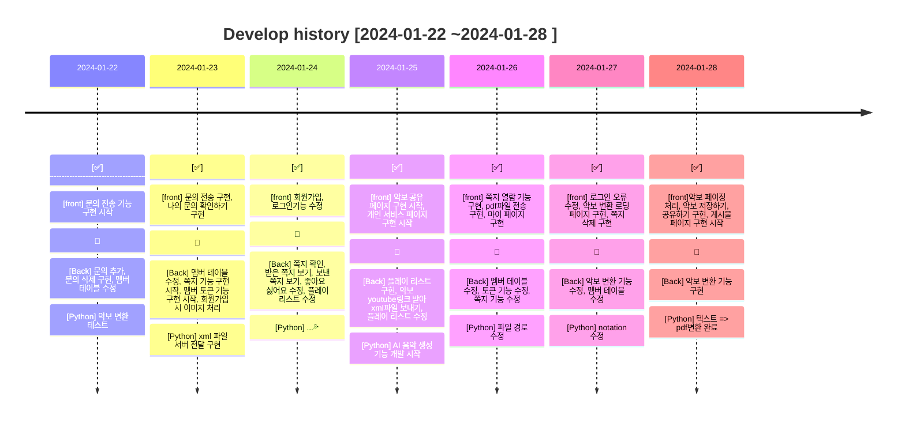
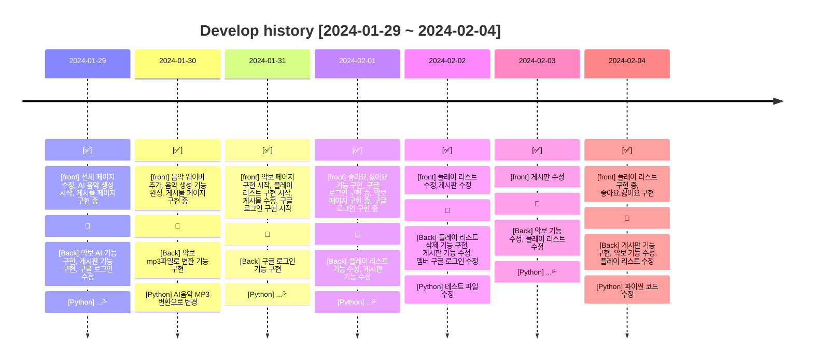
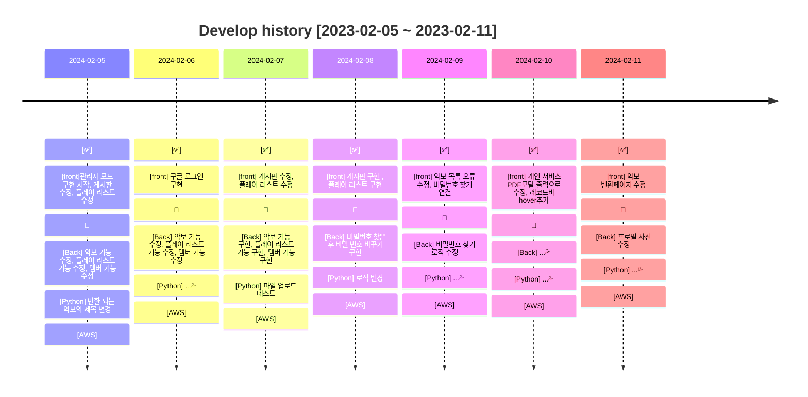
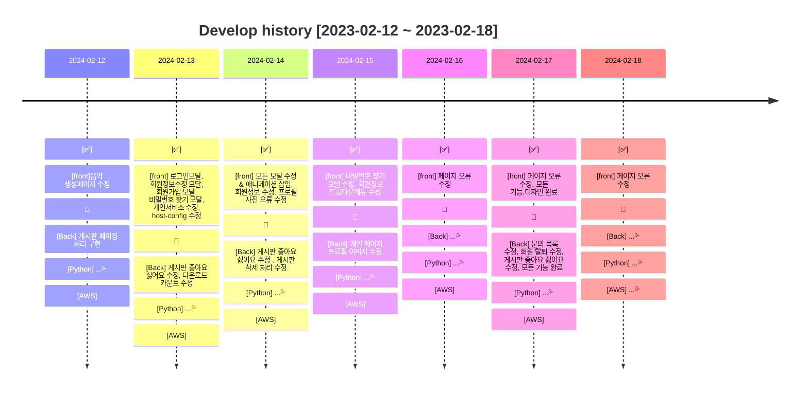
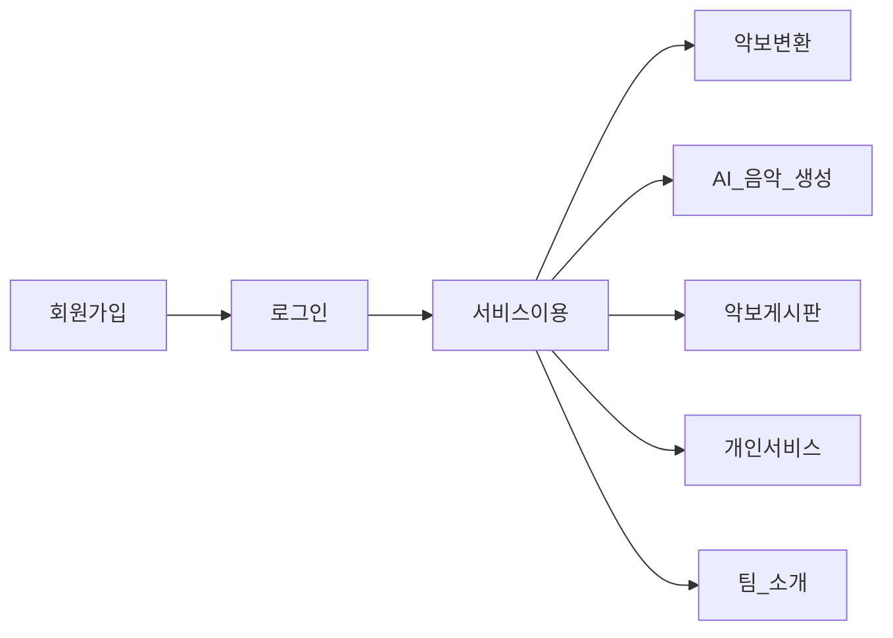
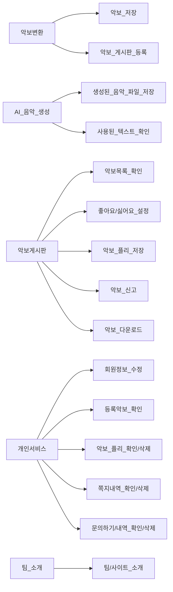

#  크레센도

### LINK 👉  크레센도 스프링 (백엔드) https://github.com/TeamCrescendo/Crescendo-Spring 
### LINK 👉  크레센도 파이썬 (백엔드) https://github.com/TeamCrescendo/Crescendo_React 
### LINK 👉  크레센도 리액트 (프론트) https://github.com/TeamCrescendo/Crescendo_python 

 
※메인 테마 자료
 

   

  

### 목차

1. [서비스 개요](#📢-서비스-개요)
2. [팀원 소개](#👋-팀원)
3. [기술 스택](#🔨-기술-스택)
4. [주요 기능 및 로직 소개](#🎯-주요-기능-및-로직-소개)
5. [개발 이력](#📜-개발-이력)
6. [버전 정보](#💡-버전-정보)
7. [데이터베이스](#⚙-DataBase)
8. [Git Flow](#🐱‍🏍-Git-Flow)

  

### 📢 서비스 개요

---

#### 음악에 관심있는 초보 음악러들을 위한 공간,

#### 혹은 악보를 변환하고 싶은 중수 음악러들을 위한 공간이죠

 

크레센도는 좋은 음악을 알고는 있지만 해당 음악의 악보를 찾을 수 없는 경우에 도움이 될 수 있습니다.

초보 음악러들이 악보를 간편하게 만드는 서비스를 이용하여 더욱 음악에 흥미를 가지도록 제작했습니다.

또한, AI 음악 생성기능을 통해 작곡체험을 할 수 있습니다.

### 지금 바로 크레센도에 방문해보세요!

  

### 👋 팀원 소개

---

| 이름         | 담당                  | GITHUB                        |
|------------|---------------------|-------------------------------|
| 👨‍💻 한태용  | PM, <b>✨BACK</b>    | https://github.com/xodyd12   |
| 👨‍💻 김다빈  | <b>✨FRONT</b>       | https://github.com/daveen99 |
| 👨‍💻 경규현  | FRONT, <b>✨BACK</b> | https://github.com/rudrbgus   |
| 👩‍💻 장선경  | BACK, <b>✨AI</b>    | https://github.com/sunk-dev  |
| 👨‍💻 원용제  | <b>✨FRONT</b>       | https://github.com/Y-ja   |

  

### 🔨 기술 스택
---
#### 📜 FRONT

  
  
  
  
  

#### 🛠️ BACK

  
  
  
  
  

#### 📀 DB

  

#### ✂️ Tool

  
  

#### ⭐️ etc

  
  
  
  

 

  

### 🎯 주요 기능 및 로직 소개

---

### 📄 회원가입 & 로그인
- 회원은 일반, 구글 계정을 통해 회원가입 및 로그인이 가능합니다.
- 비밀번호를 잊은 회원은 [비밀번호 찾기] 를 통해 새로운 비밀번호를 등록할 수 있습니다.
- 관리자를 제외한 모든 사용자는 하루에 5번의 변환횟수를 리필받습니다.
- 악보변환과 AI 음악 생성 기능은 로그인 하지 않으면 이용할 수 없습니다.
- 회원 기능: [등록된 악보 확인, 악보 플리, 쪽지, 문의, 회원정보 변경]
- 관리자 기능: [문의 답변]
 붙여넣기, 제출을 통해 유튜브 영상을 악보로 변환 할 수 있습니다.
- 변환된 악보를 저장할 수 있으며, 공유하기를 선택할 시 악보 게시판에 등록됩니다.
- 일부 유튜브 정책에 따라서 변환이 불가능한 영상도 존재합니다.
- 악보 변환시 변환횟수가 1회 차감됩니다.

### 📄 2. AI 음악 생성 페이지
- 회원은 음악 재생시간을 1초 부터 10초까지 지정할 수 있습니다.
- 회원은 생성할 음악에 관련된 설명을 입력하여 음악을 생성할 수 있습니다.
- 생성된 음악은 다운로드가 가능하며, 해당 페이지의 음악 플레이어로 감상할 수 있습니다.
- 생성된 음악에 사용된 설명을 확인할 수 있습니다.

### 📄 3. 악보 게시판
- 크레센도의 회원들이 공유한 악보목록을 확인 할 수 있습니다.
- 비로그인 회원 또한 악보목록을 확인 할 수 있습니다.
- 클릭하면 해당 악보를 자세히 볼 수 있습니다.
    1. 좋아요/싫어요를 설정 할 수 있습니다.
    2. 사용자의 악보 플리에 추가 할 수 있습니다. (플리가 없을 시 추가할 수 있음)
    3. 악보를 신고할 수 있습니다. (신고누적 5회시, 해당 악보 블락처리)
    4. 해당 악보를 등록한 회원에게 쪽지 메세지를 보낼 수 있습니다.

### 📄 4. 개인서비스
- 사용자의 프로필사진, 닉네임, 계정명, 변환횟수가 표시됩니다.
- 회원 정보 수정이 가능합니다.
    1. 닉네임, 이메일, 비밀번호, 프로필사진을 선택하여 수정할 수 있습니다.
- 회원탈퇴가 가능합니다.
    1. 회원탈퇴 버튼을 클릭하면, 사용자 정보를 삭제합니다.
    2. 회원정보는 바로 삭제되지 않고, 유예기간을 갖게 되고 기간이 만료되면 삭제됩니다.

### 📄 5. 팀 소개 페이지
- 소개 글

### 📜 개발 이력

---

### 🕘 개발 기간 (약 한 달 소요)
2024-01-10 ~ 2024-02-

 

  

### 💡 버전 정보

---

#### ✅ 크레센도 v0.1 초기 개발 병합

---

  

### ⚙ 데이터베이스

---
### 10 Tables

  

### 🐱‍🏍 Git Flow

---

- #### main(master) : 서비스가 출시되는 브랜치

> 1. 커밋 메세지에 이름을 달아서 버전을 알려줍니다.
     ex) FRONTEND - CRESCENDO v0.1

- #### [이름] / [기능] : 해당 개발자가 표시된 기능을 개발하는 브랜치

> ex) veen/login : veen 개발자가 로그인 기능을 개발하는 브랜치
